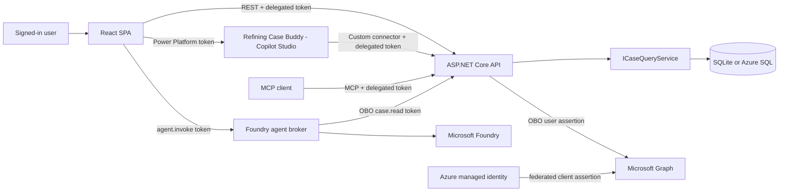
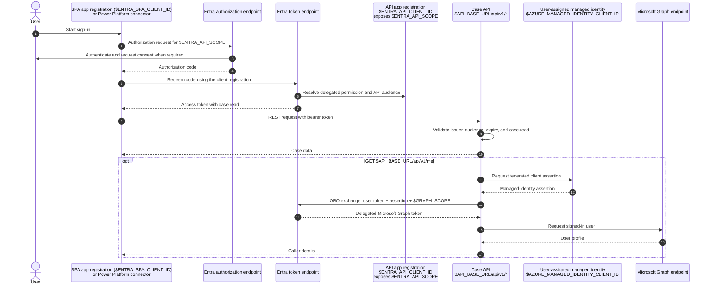
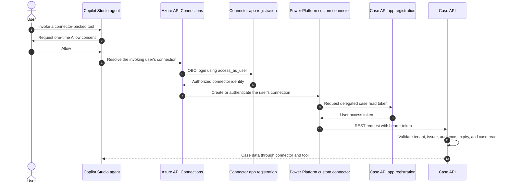

# OGE Refining Case Web App

A read-only refinery case reporting application built with ASP.NET Core, React, EF Core, Microsoft Entra ID, Microsoft Foundry, Copilot Studio, and Azure. The fictional Northstar Demonstration Refinery dataset models a connected root-cause investigation. All facilities, people, cases, and events in this repository are demonstration data.

## Deployment layers

The repository contains four independently deployable layers:

1. **[Web app and data backend](#1-core-solution-web-app-with-data)** - the ASP.NET Core Case API, EF Core data store, and React SPA.
2. **[Copilot Studio connection](#2-embedding-the-agent-refining-case-buddy)** - the hosted Refining Case Buddy agent, embedded in the SPA and connected through Power Platform.
3. **[Foundry agent and connection](src/foundry-agent/README.md)** - the Python Microsoft Foundry agent broker, delegated OBO flow, Docker packaging, and the SPA's Foundry panel.
4. **[Cowork-compatible MCP server](#4-cowork-compatible-mcp-server)** - the Streamable HTTP MCP endpoint hosted by the Case API.

The Case API is the shared read-only data boundary. Copilot Studio, the Foundry broker, the SPA, and MCP clients remain separate clients of that boundary.

## Architecture



REST controllers and MCP tools delegate reads to the same `ICaseQueryService`; the MCP layer does not duplicate persistence logic. Production requires authentication and refuses to start with authentication disabled.

## Repository layout

| Path | Purpose |
|---|---|
| `src/api/Oge.Refining.CaseApp.Api` | ASP.NET Core REST and MCP host |
| `src/api/Oge.Refining.CaseApp.Application` | Contracts and query-service boundary |
| `src/api/Oge.Refining.CaseApp.Infrastructure` | EF Core persistence and Graph OBO |
| `src/web` | React/Vite SPA, including the embedded Case Buddy panel |
| `src/foundry-agent` | Microsoft Foundry agent and FastAPI broker |
| `tests/Oge.Refining.CaseApp.Api.Tests` | API, authorization, and MCP integration tests |
| `infra` | Azure Bicep infrastructure |
| `scripts` | Deployment and Entra automation |
| `openapi` | Power Platform connector description used by the agent |
| Copilot Studio | Hosted Refining Case Buddy agent; tenant-specific source exports are intentionally excluded |
| `docs` | Deep-dive references for authentication, deployment, and Entra registration |

---

## 1. Core solution: web app with data

The core solution is a read-only case-reporting web app: an ASP.NET Core API backed by EF Core, and a React SPA that searches and displays cases. Layers 2 through 4 add independent ways to reach this same API and data; none changes how the core solution works.

### Solution components

| Component | Project/path | What it does |
|---|---|---|
| Case API | `src/api/Oge.Refining.CaseApp.Api` | ASP.NET Core host exposing the REST controllers, JWT bearer authentication/authorization policies, Swagger, health checks, and Application Insights telemetry. Its MCP endpoint is described in [Layer 4](#4-cowork-compatible-mcp-server). |
| Application layer | `src/api/Oge.Refining.CaseApp.Application` | Framework-free contracts (`CaseSummary`, `CaseDetail`, `CaseQuery`, `PagedResult<T>`, and the `CaseType`/`CaseStatus`/`CaseSeverity` enums) plus the `ICaseQueryService` boundary that both REST and MCP depend on. |
| Infrastructure layer | `src/api/Oge.Refining.CaseApp.Infrastructure` | EF Core `CaseDbContext` and migrations, the SQLite/Azure SQL implementation of `ICaseQueryService`, and `GraphOboCallerProfileService`, which resolves the signed-in user through on-behalf-of. |
| React SPA | `src/web` | The "Northstar Refining" case console: MSAL sign-in, a searchable/filterable case table with status and severity metrics, and a case detail drawer with a rendered timeline. |
| Azure infrastructure | `infra/main.bicep` | Bicep template provisioning the App Service (API), Static Web App (SPA), Azure SQL, a user-assigned managed identity, Log Analytics, and Application Insights. See [Deploy to Azure](#deploy-to-azure) for the full resource list. |
| Deployment automation | `scripts/deploy-azure.ps1` | End-to-end script: deploys the Bicep template, wires managed-identity federation and SQL access, publishes the API and SPA, regenerates the deployed Power Platform Swagger, and probes health. |
| Tests | `tests/Oge.Refining.CaseApp.Api.Tests` | Integration tests covering REST authorization, pagination and validation, case retrieval, `/api/v1/me`, and MCP tool behavior against the ASP.NET Core test host. |
| Docs | `docs/` | Deep-dive references for authentication, Azure deployment, and Entra app registration. |

### REST API

| Method | Route | Purpose |
|---|---|---|
| `GET` | `/api/v1/health` | Health probe |
| `GET` | `/api/v1/cases` | Search and filter cases |
| `GET` | `/api/v1/cases/{id}` | Retrieve case details and timeline |
| `GET` | `/api/v1/me` | Return the Graph caller through OBO |

Case-list query parameters are `search`, `status`, `severity`, `type`, `page`, and `pageSize`. Pages are one-based and `pageSize` is limited to 100. Invalid pagination returns RFC 7807 problem details.

Swagger is available at `$LOCAL_API_BASE_URL/swagger` in Development. The Power Platform source is `openapi/power-platform.swagger.json`; deployment writes the generated-host version to `openapi/power-platform.deployed.swagger.json`.

### Data model

Every client — REST, MCP, the Power Platform connector, and Case Buddy — reads the same case shape, defined once in `CaseContracts.cs` (`src/api/Oge.Refining.CaseApp.Application/Cases/CaseContracts.cs`) and persisted by `CaseRecord`/`CaseTimelineRecord` (`src/api/Oge.Refining.CaseApp.Infrastructure/Data/CaseRecord.cs`):

- **Case** — `CaseNumber`, `Title`, `RefineryName`, `ProcessUnitName`, `Type`, `Status`, `Severity`, `ReportedAt`, `UpdatedAt`, a free-text `Description`, a `RegulatoryNotifiable` flag, and an ordered `Timeline`.
- **CaseType** — `Incident`, `NearMiss`, `NonConformance`, `SafetyObservation`, `MaintenanceIssue`, `EnvironmentalConcern`.
- **CaseStatus** — `Open`, `InProgress`, `OnHold`, `Closed`.
- **CaseSeverity** — `Informational`, `Minor`, `Moderate`, `Major`, `Critical`.
- **CaseTimelineEntry** — a typed, timestamped, attributed entry (`EntryType`, `AuthorName`, `OccurredAt`, `Content`) attached to a case. Seed data uses case-specific entries such as `ProcessData`, `Alarm`, `Safeguard`, `Inspection`, `RecordsReview`, `Interview`, `ProcedureReview`, `ConfigurationHistory`, `LaboratoryResult`, `ImmediateAction`, and `FunctionalTest` to model operational chronologies, not generic status updates.

EF Core migrations seed the fictional Northstar dataset, including the connected incident/precursor pair described above, an environmental analyzer excursion, a compressor near miss, an inspection-record discrepancy, and additional quality and safety cases. The September 2026 chronology provides enough narrative depth and status variety for search, retrieval, and conversational Q&A across every client.

### Authentication

Clients request `$ENTRA_API_SCOPE` on behalf of the signed-in user. The API validates the token's signature, tenant, issuer, expiry, audience, and `case.read` scope. It accepts the API identifier URI and API client ID as canonical audiences for the same registration.

For `/api/v1/me`, the incoming token becomes the OBO user assertion. The API authenticates itself to Entra with a federated assertion from the user-assigned managed identity identified by `$AZURE_MANAGED_IDENTITY_CLIENT_ID`; it does not use an API client secret. Entra returns a delegated Graph token for `$GRAPH_SCOPE`.

SPA access uses a delegated token obtained directly through MSAL. Power Platform access has an additional, separate OBO login bootstrap between Copilot Studio, Azure API Connections, and the custom connector. That bootstrap creates or resolves the invoking user's connector connection before the connector obtains the delegated Case API token. It is distinct from the API-to-Graph OBO exchange.

#### SPA, connector, and Graph OBO flow

The SPA registration (`$ENTRA_SPA_CLIENT_ID`) and the Power Platform connector used by Refining Case Buddy ([Part 2](#2-embedding-the-agent-refining-case-buddy)) are both delegated clients of the API registration (`$ENTRA_API_CLIENT_ID`). Both request `$ENTRA_API_SCOPE`; the API registration exposes its `case.read` permission and identifies the accepted token audience.



The managed identity is an Azure identity, not another client-secret-bearing app registration. Its federated credential is associated with the API registration so Entra can accept its assertion during the OBO exchange.

The API itself is secretless: its Graph OBO exchange uses managed-identity federation, and its Azure SQL connection uses the same managed identity. Do not put client secrets, user passwords, refresh tokens, raw access tokens, authorization headers, or cookies in this repository or its `.env` files.

### Configuration

Copy the repository template and supply values for your environment:

```powershell
Copy-Item .env.example .env
```

`.env` is ignored by Git. `.env.example` contains placeholders only and is the canonical catalog for the project-specific values referenced here. Load those values into the current process before running `scripts/deploy-azure.ps1`; the core deployment script does not read `.env`. The Foundry deployment script loads missing process values from `.env` without overwriting values already set. Bicep supplies hosted ASP.NET Core settings, while Vite receives the corresponding browser settings during build.

The variables below configure the core solution. Each integration layer adds its own settings on top of these.

| Variable | Description | Source |
|---|---|---|
| `$AZURE_SUBSCRIPTION_ID` | Azure subscription into which the resources are deployed. | **Subscription ID** in the Azure portal or `az account show --query id`. |
| `$AZURE_RESOURCE_GROUP` | Resource group that owns the case-app resources. | A deployment choice; use an existing resource group name or choose the name the deployment should create. |
| `$AZURE_LOCATION` | Primary region for App Service, SQL, managed identity, and monitoring. | A deployment choice from `az account list-locations`; the current Bicep default is `northcentralus`. |
| `$AZURE_STATIC_WEB_APP_LOCATION` | Region for the Static Web App, which can differ from the primary region. | A deployment choice from the regions that support Azure Static Web Apps; the current Bicep default is `eastus2`. |
| `$AZURE_CLI_PATH` | Optional path to the Azure CLI executable when `az.cmd` is not on `PATH`. | The local Azure CLI installation, for example the result of `Get-Command az.cmd`. Leave empty when Azure CLI is on `PATH`. |
| `$ENTRA_TENANT_ID` | Directory tenant that owns the app registrations and deployed identities. | **Tenant ID** on the Microsoft Entra overview page or `az account show --query tenantId`. |
| `$ENTRA_API_CLIENT_ID` | Client/application ID of the Case API app registration; also forms the API token audience. | **Application (client) ID** on the API app registration's Microsoft Entra overview page. |
| `$ENTRA_API_APP_OBJECT_ID` | Directory object ID of the Case API application object, used when configuring federation. | **Object ID** on the API app registration's Microsoft Entra overview page; this is not its client ID or service-principal object ID. |
| `$ENTRA_API_SCOPE` | Fully qualified delegated permission clients request to read cases. | The API app registration's **Expose an API** page; normally `api://<ENTRA_API_CLIENT_ID>/case.read`. |
| `$ENTRA_SPA_CLIENT_ID` | Client/application ID used by the browser SPA during MSAL sign-in. | **Application (client) ID** on the SPA app registration's Microsoft Entra overview page. |
| `$ENTRA_SPA_APP_OBJECT_ID` | Directory object ID of the SPA application object, used to update redirect URIs. | **Object ID** on the SPA app registration's Microsoft Entra overview page; this is not its client ID or service-principal object ID. |
| `$ENTRA_ADMIN_OBJECT_ID` | Object ID of the user assigned as the Azure SQL Microsoft Entra administrator during provisioning. | The selected user's **Object ID** in Microsoft Entra or `az ad signed-in-user show --query id` when using the signed-in operator. |
| `$ENTRA_ADMIN_NAME` | Display name or UPN paired with the Azure SQL administrator object ID. | The same Microsoft Entra user record as `$ENTRA_ADMIN_OBJECT_ID`, using its `displayName` or `userPrincipalName`. |
| `$LOCAL_API_BASE_URL` | Base URL of the locally running ASP.NET Core API. | The API HTTP launch profile in `src/api/Oge.Refining.CaseApp.Api/Properties/launchSettings.json`. |
| `$LOCAL_SPA_BASE_URL` | URL of the local Vite development server. | The Vite dev-server configuration; it defaults to `http://localhost:5173`. |
| `$API_BASE_URL` | Public HTTPS base URL of the deployed Case API. | The `apiUrl` output from `infra/main.bicep` or the App Service **Default domain** in Azure. |
| `$GRAPH_SCOPE` | Microsoft Graph scope requested by the API's OBO exchange. | Microsoft Graph's documented application default scope, `https://graph.microsoft.com/.default`. |
| `$AZURE_MANAGED_IDENTITY_CLIENT_ID` | Client ID of the user-assigned identity used by App Service for Azure SQL and federated OBO authentication. | The `managedIdentityClientId` output from `infra/main.bicep` or the managed identity's Azure overview page; populate only when another configuration needs the deployed identity. |

### Run locally

Requirements are .NET SDK 8, Node.js 22, npm, and PowerShell 5.1 or later.

Start the API:

```powershell
dotnet run --project src/api/Oge.Refining.CaseApp.Api --launch-profile http
```

Development uses SQLite and an explicit local identity with `case.read`; it does not require an Entra token.

Start the SPA in another terminal:

```powershell
Set-Location src/web
npm install
npm run dev
```

Open `$LOCAL_SPA_BASE_URL`. Vite proxies `/api` to `$LOCAL_API_BASE_URL`.

### Run automated checks

```powershell
dotnet test Oge.Refining.CaseApp.sln

Push-Location src/web
npm run lint
npm run build
Pop-Location
```

### Deploy to Azure

Before deployment, populate `.env`, sign in with Azure CLI, and ensure the operator can deploy resources, update both Entra applications, and administer Azure SQL. Install the .NET SDK, Node.js/npm, Azure CLI, and the PowerShell `SqlServer` module or allow the script to install it.

```powershell
az login --tenant $env:ENTRA_TENANT_ID
az account set --subscription $env:AZURE_SUBSCRIPTION_ID
.\scripts\deploy-azure.ps1
```

The script validates and deploys `infra/main.bicep` into `$AZURE_RESOURCE_GROUP`, reads generated outputs, configures managed-identity federation, adds the SPA redirect URI, bootstraps the Azure SQL identity, deploys the API and SPA, generates the deployed Power Platform Swagger, and probes health.

`infra/main.bicep` provisions:

- An App Service plan (Free `F1`) and App Service hosting the Case API, configured with health checks, CORS for the SPA origin, and the app settings for authentication, the database connection, and OBO.
- A Static Web App hosting the SPA.
- An Azure SQL logical server (Microsoft Entra-only authentication, no SQL logins) and a `Basic`-tier database.
- A user-assigned managed identity, used both as the Azure SQL connection identity and as the federated credential for the API's Graph OBO exchange — the API is never given a client secret.
- A Log Analytics workspace and Application Insights instance for API telemetry.

The Azure SQL external-user SID must be the managed identity **client ID**, not its principal/object ID. The script verifies and repairs that mapping. Any public SQL networking must comply with the target organization's policy.

After deployment, confirm health returns `200`; anonymous case and MCP requests return `401`; OAuth metadata is correct; the SPA list, detail, and `/api/v1/me` calls work; both MCP tools accept a delegated token; cases survive an API restart; and Application Insights has no unexpected request, dependency, or exception failures.

---

## 1.5. Consuming the REST API from Copilot Studio

Copilot Studio does not call the Case API with the agent maker's API connection. The agent's direct connector actions preserve the invoking user, and the custom connector obtains a delegated `case.read` token for that user. Seamless connection creation requires a second permission surface on the connector app registration in addition to its delegated permission to the Case API.

### Connector authentication chain



The connector app registration must have all of the following:

- Its own identifier URI, `api://<CONNECTOR-CLIENT-ID>`.
- An enabled delegated scope named `access_as_user`.
- Azure API Connections application `fe053c5f-3692-4f14-aef2-ee34fc081cae` pre-authorized for `access_as_user`.
- Delegated permission to `$ENTRA_API_SCOPE`, with tenant admin consent where required.
- Every generated Power Platform connector redirect URI registered as a web redirect URI.
- A confidential-client credential. This deployment uses the Power Platform `power-platform-managed-identity` federated credential and stores no connector client secret.

The custom connector must use Microsoft Entra ID OAuth, request `$ENTRA_API_SCOPE`, set its resource URI to `api://<ENTRA_API_CLIENT_ID>`, and enable **on-behalf-of login**. Its exported connection parameters use `authorization_code_with_federated_identity_credentials` and `genericFederatedIdentityCredential`, matching the connector app's secretless federated credential.

The connector must be shared **Can view** with intended users. Those users must exist in the Power Platform environment and have a Dataverse role granting `prvReadconnector`; **Basic User** provides that privilege. Agent connector actions use `InvokeConnectorTaskAction` with `mode: Invoker` so the runtime does not fall back to the maker's connection.

The one-time **Allow** card is expected. After **Allow**, Power Platform should create or authenticate the invoking user's connection without sending the user to Connection Manager. A Connection Manager fallback indicates that connector OBO preauthorization, connector sharing, environment privileges, or the per-user tool connection binding remains incomplete.

This connector-side bootstrap ends when the Case API receives the delegated `case.read` token. If the request is `/api/v1/me`, the API then performs the separate managed-identity-backed OBO exchange to Microsoft Graph described in [Part 1](#spa-connector-and-graph-obo-flow).

---

## 2. Embedding the agent: Refining Case Buddy

Refining Case Buddy is a Microsoft Copilot Studio agent embedded directly in the SPA as a chat panel. It gives the same case data ([Part 1](#1-core-solution-web-app-with-data)) a conversational interface, reached through a custom Power Platform connector rather than a direct database connection.

### Solution components

| Component | Path | What it does |
|---|---|---|
| Case Buddy panel | `src/web/src/CaseBuddy.tsx` | React component that renders the chat panel and connects it to the agent. |
| Copilot Studio configuration | `src/web/src/copilot.ts` | Reads `environmentId`/`agentIdentifier` from Vite env vars and defines the Power Platform token scope. |
| Refining Case Buddy | Copilot Studio environment | Hosted agent with instructions, topics, direct connector actions, and connector bindings. Tenant-specific source exports are intentionally excluded from this repository. |
| Power Platform connector | `openapi/power-platform.swagger.json` | Custom-connector description of the Case API surface, imported into Power Platform so the agent's actions can call it with delegated auth. |

### SPA embedding

`CaseBuddy.tsx` renders a docked chat panel that the SPA's "Case Buddy" nav item toggles on and off. On mount it:

1. Lazy-loads `@microsoft/agents-copilotstudio-client` and `botframework-webchat`, keeping them out of the main SPA bundle.
2. Silently acquires a token for the Power Platform scope (`https://api.powerplatform.com/.default`) using the signed-in MSAL account. If silent acquisition requires interaction, it shows an **Authorize Case Buddy** button that opens an MSAL popup instead of failing outright.
3. Builds a `CopilotStudioClient` from `ConnectionSettings` (the configured `environmentId` and `agentIdentifier`) and the acquired token, then opens a `CopilotStudioWebChat` connection.
4. Mounts `ReactWebChat` using React 19's `createRoot`. The package's `renderWebChat` helper uses the legacy `ReactDOM.render` API and is not compatible with React 19.

The panel surfaces connection, loading, and reauthorization states, and lets the user start a new conversation without reloading the page.

### Power Platform connector

Import `openapi/power-platform.deployed.swagger.json` as a custom connector. Configure delegated `$ENTRA_API_SCOPE`, save it, and add the generated redirect URI to the connector app registration before creating a connection. Configure the connector-side OBO scope, Azure API Connections preauthorization, sharing, and user privileges described in [Part 1.5](#15-consuming-the-rest-api-from-copilot-studio); delegated API permission alone is not sufficient for seamless agent connection creation.

### Refining Case Buddy agent definition

Refining Case Buddy is managed in Copilot Studio. Its tenant-specific solution export is intentionally not stored in this repository. The hosted agent includes:

- `agent.mcs.yml` sets the agent's instructions ("assist users in navigating and refining cases within the organization's case management system, ensuring accuracy, completeness, and compliance with internal procedures"), enables web browsing, and pins a model hint (`Sonnet46`).
- Standard Copilot Studio system topics plus a custom search topic for free-form case questions.
- Direct `ListCases` and `GetCase` connector actions running in `Invoker` mode.
- A connection reference to the case-management custom connector described by `openapi/power-platform.swagger.json`, so case lookups use the delegated, authenticated Case API.

### Configuration

In addition to the [core configuration](#configuration), the embedded agent needs:

| Variable | Description | Source |
|---|---|---|
| `$COPILOT_STUDIO_ENVIRONMENT_ID` | Power Platform environment containing the Refining Case Buddy copilot. | Copilot Studio environment selector or the environment ID in the Power Platform admin center/URL. |
| `$COPILOT_STUDIO_SCHEMA_NAME` | Unique schema name of the copilot that the embedded Microsoft 365 Agents SDK opens. | The copilot's **Schema name** in Copilot Studio solution details, not its display name. |

---

## 3. Foundry agent and connection

The in-repository [Foundry agent project](src/foundry-agent/README.md) contains the Python prompt agent, FastAPI broker, delegated OBO implementation, read-only Case API contract, Dockerfile, and tests. The SPA's separate Foundry panel requests the broker's `agent.invoke` scope and calls `POST /api/chat`; the broker preserves that signed-in user while exchanging for `case.read` and calling the Case API.

Deploy the broker independently from the core web stack, then provide `$BROKER_BASE_URL` and `$BROKER_CLIENT_ID` when running `scripts/deploy-azure.ps1`. The script builds the SPA with `VITE_BROKER_BASE_URL` and `VITE_BROKER_SCOPE`, connecting the deployed web client to the broker without combining it with the Copilot Studio integration.

---

## 4. Cowork-compatible MCP server

The same Case API also hosts a Model Context Protocol (MCP) server, so any MCP-capable agent or IDE can call `search_cases` and `get_case` as tools, using the same delegated `case.read` authorization used elsewhere in this solution ([Part 1](#authentication)).

### Solution components

| Component | Path | What it does |
|---|---|---|
| MCP tools | `src/api/Oge.Refining.CaseApp.Api/Mcp/CaseTools.cs` | `[McpServerToolType]` class exposing `search_cases` and `get_case`, delegating to the same `ICaseQueryService` as REST. |
| MCP host wiring | `src/api/Oge.Refining.CaseApp.Api/Program.cs` | Registers `AddMcpServer().WithHttpTransport()`, maps `POST /mcp`, and applies the MCP-specific authorization policy and OAuth protected-resource metadata. |

### REST route

| Method | Route | Purpose |
|---|---|---|
| `POST` | `/mcp` | MCP Streamable HTTP transport |

### MCP server

The API hosts a stateless Streamable HTTP MCP server at `$MCP_SERVER_URL`. It supports JSON-RPC 2.0 `tools/list` and `tools/call`, structured output, and OAuth protected-resource discovery.

| Tool | Purpose | Inputs |
|---|---|---|
| `search_cases` | Search, filter, and page through case summaries | `search`, `status`, `severity`, `type`, `page`, `pageSize` |
| `get_case` | Retrieve one case with description and timeline | `id` |

Both tools advertise `readOnlyHint: true`, `destructiveHint: false`, `idempotentHint: true`, and `openWorldHint: false`.

### OAuth discovery

An unauthenticated MCP request returns `401` with a `WWW-Authenticate` challenge pointing to:

```text
$API_BASE_URL/.well-known/oauth-protected-resource/mcp
```

The metadata identifies `$MCP_SERVER_URL` as the protected resource, `$MCP_AUTHORIZATION_SERVER` as the authorization server, and `$ENTRA_API_SCOPE` as the delegated scope. Hosted clients send the resulting bearer token to `$MCP_SERVER_URL`.

### Configuration

In addition to the [core configuration](#configuration), the MCP server needs:

| Variable | Description | Source |
|---|---|---|
| `$LOCAL_MCP_SERVER_URL` | Streamable HTTP endpoint of the local MCP server. | Derived from `$LOCAL_API_BASE_URL` by appending `/mcp`. |
| `$MCP_SERVER_URL` | Public Streamable HTTP endpoint used by hosted MCP clients. | Derived from `$API_BASE_URL` by appending `/mcp`. |
| `$MCP_AUTHORIZATION_SERVER` | Entra issuer advertised by MCP protected-resource metadata. | Derived from `$ENTRA_TENANT_ID` as `https://login.microsoftonline.com/<tenant-id>/v2.0`. |

### Use and verify the MCP server

For local development, start the API as described in [Run locally](#run-locally); the MCP endpoint becomes available at `$LOCAL_MCP_SERVER_URL`. A workspace-local `.vscode/mcp.json` (not checked in) can register it as `case-app-content` for VS Code's MCP tooling.

For a local MCP smoke test, point an MCP client at `$LOCAL_MCP_SERVER_URL`, list the tools, call `search_cases`, then pass a returned ID to `get_case`.

For a hosted smoke test, acquire `$ENTRA_API_SCOPE` with a consented delegated client and connect to `$MCP_SERVER_URL`. Verify that anonymous requests return `401`, protected-resource metadata names `$MCP_AUTHORIZATION_SERVER` and `$ENTRA_API_SCOPE`, and authenticated calls return structured content. Never print or persist the token.

---

## Operational limits

- The default free App Service plan can cold-start and is intended for demonstration workloads.
- Startup applies EF Core migrations, so the runtime managed identity currently needs DDL rights. A hardened production deployment should use a separate migration identity.
- Prefer approved private Azure SQL connectivity for production.
- MCP tools are deliberately read-only. Write tools require explicit authorization, confirmation, and destructive-action annotations.
