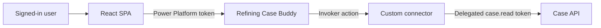

# Power Platform and Refining Case Buddy

Refining Case Buddy is a Copilot Studio agent embedded in the React SPA. Its `ListCases` and `GetCase` actions call the Case API through a custom connector and preserve the signed-in user's delegated identity.

## Request path

The browser token used to open Copilot Studio and the connector token used to call the Case API are separate. A user can reach the agent while connector authorization is still incomplete.

## Components

| Path | Purpose |
|---|---|
| Copilot Studio environment | Hosted Refining Case Buddy agent, topics, actions, and connection references; its tenant-specific export is intentionally not stored in this repository |
| `openapi/power-platform.swagger.json` | Source OpenAPI definition for the custom connector |
| `openapi/power-platform.deployed.swagger.json` | Environment-specific definition generated by deployment |
| `src/web/src/CaseBuddy.tsx` | Embedded chat panel |
| `src/web/src/copilot.ts` | Copilot Studio environment and token configuration |

Both active case actions use `InvokeConnectorTaskAction` with `mode: Invoker`. The exported Power Automate workflow is retained as a legacy solution component and is not part of the current action path.

## Connector identity

The connector app registration needs:

- Delegated permission to `api://<API-CLIENT-ID>/case.read`, with the required tenant consent.
- Its own identifier URI, `api://<CONNECTOR-CLIENT-ID>`.
- An enabled delegated `access_as_user` scope.
- Azure API Connections application `fe053c5f-3692-4f14-aef2-ee34fc081cae` pre-authorized for `access_as_user`.
- Every redirect URI generated by the custom connector.
- A confidential-client credential. This environment uses the Power Platform managed-identity federated credential, not a client secret.

Configure the custom connector to use Microsoft Entra ID OAuth, request the Case API scope, set its resource URI to `api://<API-CLIENT-ID>`, and enable on-behalf-of login. Share the connector **Can view** with intended users. Each user also needs a Dataverse role that grants `prvReadconnector`; the standard **Basic User** role provides it.

The API accepts the API registration's identifier URI and client-ID GUID as equivalent token audiences because Power Platform can issue the GUID form. Tenant, issuer, signature, expiry, and `case.read` validation remain required. See [Authentication](authentication.md) for the full token design.

## Deploy to an environment

1. Deploy the Case API and generate `openapi/power-platform.deployed.swagger.json` as described in [Azure deployment](azure-deployment.md).
2. Import the generated OpenAPI file as a custom connector.
3. Save the connector, register its generated redirect URI in Entra, and verify `ListCases` with a test connection.
4. Import or provision the Refining Case Buddy solution in the target Copilot Studio environment. Keep its tenant-specific local export outside this repository.
5. Bind its connection reference to the imported custom connector.
6. Publish the agent and confirm it is active, provisioned, and synchronized.
7. Configure the SPA with the Copilot Studio environment ID and agent schema name, then deploy the SPA.

Connection-reference logical names and connector IDs are generated values. Use the values from the target environment instead of copying IDs from an older environment.

## Verify

1. Sign in to the SPA and open Case Buddy.
2. If prompted, select **Authorize Case Buddy** to grant the browser's Power Platform permission.
3. Accept the connector's one-time **Allow** prompt.
4. Verify a non-owner user can list cases and retrieve a case under their own connection.
5. Call `GetCurrentCaller` to verify the API-to-Graph OBO path.

After **Allow**, redirection to Connection Manager usually means one of the following is missing: `access_as_user` preauthorization, connector sharing, `prvReadconnector`, a redirect URI, API consent, or the user's connection binding. If a connector call reaches the API, use its HTTP status and Application Insights trace as the controlling evidence rather than treating every connector failure as an OAuth failure.

## SPA integration notes

- The SPA requests `https://api.powerplatform.com/.default` silently and offers an interactive popup when MSAL requires interaction.
- `ConnectionSettings` requires the Copilot Studio environment ID and agent schema name.
- Under React 19, mount `ReactWebChat` with `createRoot`; the package's legacy `renderWebChat` helper is incompatible.
- Keep MSAL effects anchored to a stable account identifier such as `homeAccountId` to avoid unnecessary chat reconnections.

Never store access tokens, refresh tokens, passwords, cookies, or authorization headers in the solution, repository, or deployment output.