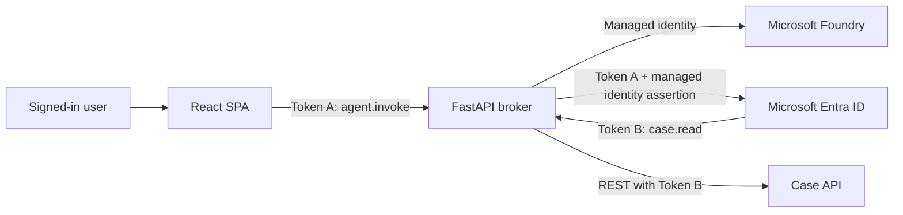

# OGE Refining Case Foundry Agent

A Microsoft Foundry prompt agent and FastAPI broker that calls the OGE Refining Case API with the signed-in user's delegated identity through Microsoft Entra on-behalf-of (OBO) authentication.

This directory is Layer 3 of the repository. The React client is in `../web/src/FoundryBuddy.tsx`; the core Case API is in `../api/Oge.Refining.CaseApp.Api`.

## Identity flow

1. The SPA obtains a delegated token for the broker's `agent.invoke` scope.
2. The broker validates tenant, issuer, audience, expiry, and scope.
3. Foundry selects a read-only Case API function tool.
4. The broker exchanges the incoming token for `case.read` through OBO.
5. The broker calls the fixed Case API route and returns the grounded answer.

Foundry never receives either access token. The broker uses a user-assigned managed identity to authenticate to Foundry and as the federated client assertion for OBO. The checked-in configuration contains no client secret.



## Configure

Copy `.env.example` to `.env` and replace every placeholder. Keep tenant IDs, app IDs, service URLs, deployment names, and managed identity IDs in `.env`; it is ignored by Git. Do not add client secrets to tracked files.

Three app registrations participate:

1. **Case API** exposes `case.read` and is the downstream token audience.
2. **Agent broker** exposes `agent.invoke`, has delegated permission to `case.read`, and trusts the deployed managed identity through a federated credential.
3. **SPA** requests `agent.invoke` and calls `/api/chat`.

Grant the managed identity `Foundry User` on the target Foundry project. Configure the broker app registration to trust that identity for `api://AzureADTokenExchange/.default` assertions.

The SPA build requires:

```text
VITE_BROKER_BASE_URL=<broker-container-app-url>
VITE_BROKER_SCOPE=api://<broker-client-id>/agent.invoke
```

Set `CORS_ALLOWED_ORIGINS` to a comma-separated list of exact SPA origins. Include `http://localhost:5173` only for browser-based local development.

## Run locally

Python 3.11 or later is required.

```powershell
Set-Location src/foundry-agent
python -m venv .venv
.\.venv\Scripts\python.exe -m pip install -e ".[dev]"
az login --tenant $env:ENTRA_TENANT_ID
.\.venv\Scripts\python.exe -m oge_refining_case_foundry_agent.main
```

Call `POST http://127.0.0.1:8000/api/chat` with an access token issued for the broker:

```powershell
$headers = @{ Authorization = "Bearer $env:BROKER_ACCESS_TOKEN" }
$body = @{ message = "Find major incidents involving pump P-204B." } | ConvertTo-Json
Invoke-RestMethod http://127.0.0.1:8000/api/chat -Method Post -Headers $headers -ContentType application/json -Body $body
```

## Validate

```powershell
Set-Location src/foundry-agent
.\.venv\Scripts\python.exe -m pytest
docker build -t oge-refining-case-foundry-agent .
```

## Deploy

From the repository root, populate the Foundry values in `.env`, then run:

```powershell
.\scripts\deploy-foundry-agent.ps1
```

The script creates the Foundry project and a dedicated broker resource group containing a managed identity, Azure Container Registry, Container Apps environment, and Container App. It builds `src/foundry-agent/Dockerfile` with ACR, configures managed-identity federation and least-privilege roles, and verifies health and CORS for the deployed SPA origin.

The repository-owned `openapi/case-api.openapi.json` documents the REST boundary used by the agent tools. The broker itself, rather than a Foundry OpenAPI connection, performs OBO so each Case API call preserves the signed-in user.

After deployment, add the broker URL and client ID to the root `.env` and run `scripts/deploy-azure.ps1` to rebuild the SPA with the Foundry connection. Verify `/health`, then sign in to the website, open **Foundry**, and ask a question requiring case data.